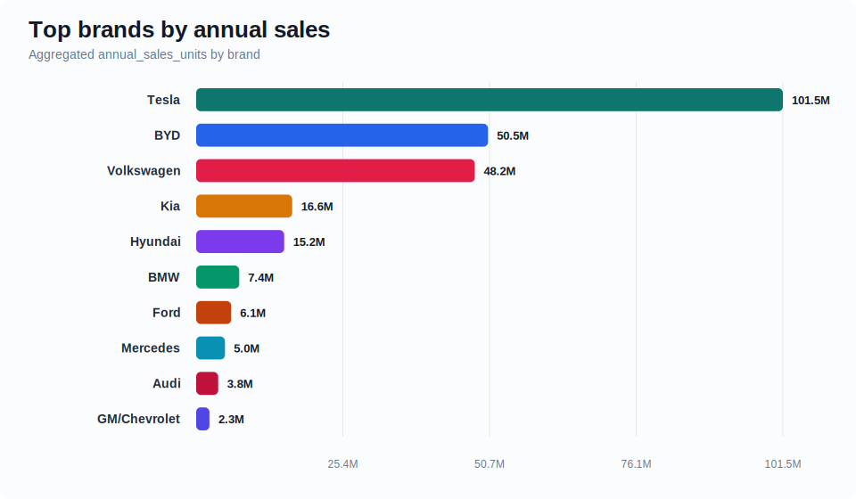
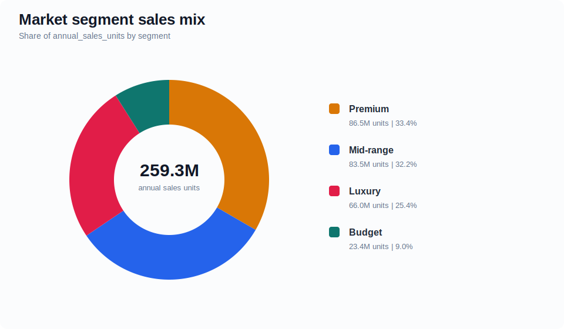
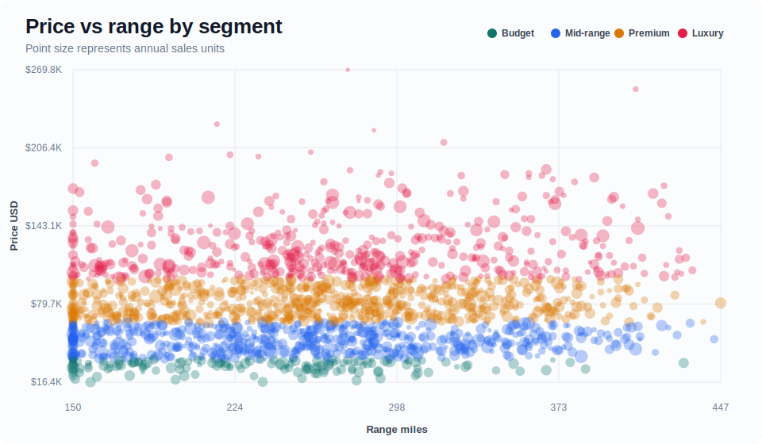
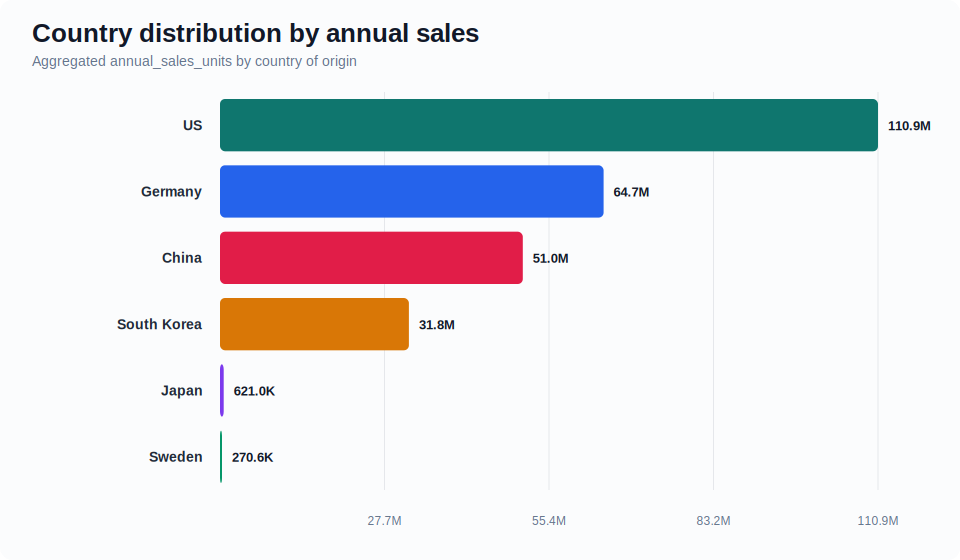

# EV Market 2026 Dashboard Report

Professional analytics report and dashboard layer built from [`ev_market_2026.csv`](ev_market_2026.csv). The analysis is scoped to the dataset in this repository; it does not claim to be an external market forecast.

**Open the dashboard:** [docs/index.html](docs/index.html)  
**Detailed report:** [reports/ev_market_2026_report.md](reports/ev_market_2026_report.md)

## Executive Snapshot

| Metric | Value |
| --- | --- |
| Records | 2,000 |
| Brands | 20 |
| Year coverage | 2020-2026 |
| Total annual sales | 259.3M |
| Average price | $78,874 |
| Median range | 261 miles |
| Average charging speed | 155.2 kW |
| Average customer rating | 3.57/5 |

## Key Findings

- **Sales concentration is high.** Tesla leads with 101.5M annual units, while the top three brands represent 77.2% of all annual sales in the dataset.
- **Premium is the largest market segment by sales volume.** It accounts for 33.4% of annual units with an average listed price of $81,102.
- **The model-level opportunity is not only price.** Range, charging speed, customer rating, and sales velocity vary widely, so the dashboard includes a price-vs-range view and sortable top-model tables.

## Charts









## Brand Leaderboard

| Brand | Annual sales | Share |
| --- | --- | --- |
| Tesla | 101.5M | 39.1% |
| BYD | 50.5M | 19.5% |
| Volkswagen | 48.2M | 18.6% |
| Kia | 16.6M | 6.4% |
| Hyundai | 15.2M | 5.9% |
| BMW | 7.4M | 2.9% |
| Ford | 6.1M | 2.3% |
| Mercedes | 5.0M | 1.9% |

## Segment Summary

| Segment | Records | Annual sales | Share | Avg price | Avg range |
| --- | --- | --- | --- | --- | --- |
| Premium | 712 | 86.5M | 33.4% | $81,102 | 264 mi |
| Mid-range | 642 | 83.5M | 32.2% | $50,689 | 255 mi |
| Luxury | 495 | 66.0M | 25.4% | $127,340 | 275 mi |
| Budget | 151 | 23.4M | 9.0% | $29,321 | 236 mi |

## Repository Structure

- `docs/index.html` - interactive dashboard layer for GitHub Pages or local review.
- `docs/assets/` - generated SVG charts used by this report.
- `docs/data/` - generated JSON data and summary extracts.
- `reports/ev_market_2026_report.md` - detailed professional write-up.
- `scripts/build_report.py` - reproducible report and dashboard builder.

## Rebuild

```powershell
python scripts/build_report.py
```

Generated on 2026-05-08 21:31.
